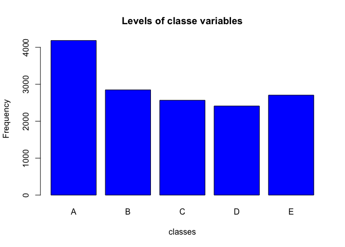
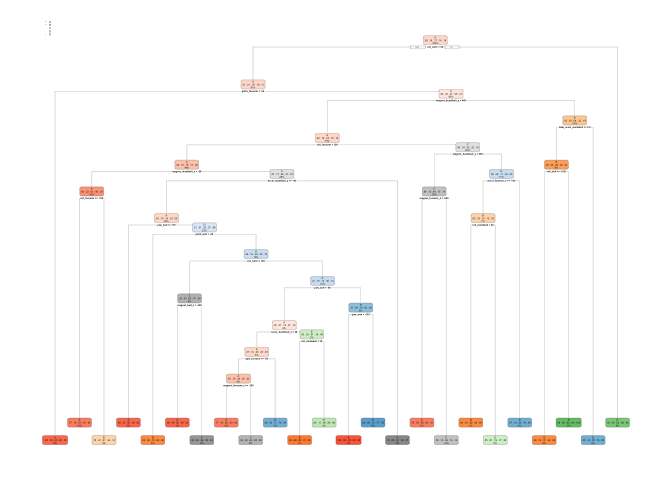

## Background

Using devices such as Jawbone Up, Nike FuelBand, and Fitbit it is now possible to collect a large amount of data about personal activity relatively inexpensively. These type of devices are part of the quantified self movement – a group of enthusiasts who take measurements about themselves regularly to improve their health, to find patterns in their behavior, or because they are tech geeks. One thing that people regularly do is quantify how much of a particular activity they do, but they rarely quantify how well they do it. In this project, your goal will be to use data from accelerometers on the belt, forearm, arm, and dumbell of 6 participants. They were asked to perform barbell lifts correctly and incorrectly in 5 different ways. More information is available from the website here: http://web.archive.org/web/20161224072740/http:/groupware.les.inf.puc-rio.br/har (see the section on the Weight Lifting Exercise Dataset).

## Data

The training data for this project are available here:
https://d396qusza40orc.cloudfront.net/predmachlearn/pml-training.csv

The test data are available here:
https://d396qusza40orc.cloudfront.net/predmachlearn/pml-testing.csv

The data for this project come from this source: http://web.archive.org/web/20161224072740/http:/groupware.les.inf.puc-rio.br/har. If you use the document you create for this class for any purpose please cite them as they have been very generous in allowing their data to be used for this kind of assignment.

## What you should submit
The goal of your project is to predict the manner in which they did the exercise. This is the "classe" variable in the training set. You may use any of the other variables to predict with. You should create a report describing how you built your model, how you used cross validation, what you think the expected out of sample error is, and why you made the choices you did. You will also use your prediction model to predict 20 different test cases.

#### Peer Review Portion:
* Your submission for the Peer Review portion should consist of a link to a Github repo with your R markdown and compiled HTML file describing your analysis. Please constrain the text of the writeup to < 2000 words and the number of figures to be less than 5. It will make it easier for the graders if you submit a repo with a gh-pages branch so the HTML page can be viewed online (and you always want to make it easy on graders :-).

#### Course Project Prediction Quiz Portion:
* Apply your machine learning algorithm to the 20 test cases available in the test data above and submit your predictions in appropriate format to the Course Project Prediction Quiz for automated grading.

## 0. Load packages  

```r
library(dplyr);        sessionInfo()$otherPkgs$dplyr$Version           ## [1] "0.7.4"
library(caret);        sessionInfo()$otherPkgs$caret$Version           ## [1] "6.0-79"
library(ggplot2);      sessionInfo()$otherPkgs$ggplot2$Version         ## [1] "2.2.1.9000"
library(randomForest); sessionInfo()$otherPkgs$randomForest$Version    ## [1] "4.6-12"
library(rpart);        sessionInfo()$otherPkgs$rpart$Version           ## [1] "4.1-13"
library(rpart.plot);   sessionInfo()$otherPkgs$rpart.plot$Version      ## [1] "2.1.2"
library(e1071)
```

## 1. Read data 
* In both traning and testing datasets, some of columns contains a lot of NA and #DIV/0!, so I load the data in the following way:

```r
# Raw tran data
rawTrain<-read.csv("pml-training.csv", header = TRUE, na.strings=c("NA", "#DIV/0!", "")); dim(rawTrain)
```

```
## [1] 19622   160
```

```r
# Raw test data
rawTest<-read.csv("pml-testing.csv", header = TRUE, na.strings=c("NA", "#DIV/0!", "")); dim(rawTest)
```

```
## [1]  20 160
```
## 2. Clean data 
* Remove variables with NA 

```r
# tran data without NA
rNA.Train <- rawTrain[ , colSums(is.na(rawTrain)) == 0]; dim(rNA.Train)
```

```
## [1] 19622    60
```

```r
# test data without NA
rNA.Test <- rawTest[ , colSums(is.na(rawTest)) == 0]; dim(rNA.Test)
```

```
## [1] 20 60
```

* Remove the first 7 columns which are related to the time-series or are not numeric.(Because the testing dataset has no time-dependence, these values are useless and can be disregarded)

```r
#head(rNA.Train)
#head(rNA.Test)

clean.Train <- rNA.Train[,8:ncol(rNA.Train)]; dim(clean.Train)
```

```
## [1] 19622    53
```

```r
clean.Test  <- rNA.Test[,8:ncol(rNA.Test)]; dim(clean.Test)
```

```
## [1] 20 53
```
## 3. Cross-validation
* Split the Train data into a training dataset and a testing dataset for cross validation


```r
set.seed(1234567)
forTraining<-caret::createDataPartition(y=clean.Train$classe, p=0.75, list=FALSE)
Training<-clean.Train[forTraining,]; dim(Training)
```

```
## [1] 14718    53
```

```r
Testing<- clean.Train[-forTraining, ]; dim(Testing)
```

```
## [1] 4904   53
```
There are 14718 samples and 53 variables for training, 4904 samples and 53 variables for testing.

### Exploratory analysis of the “classe” variables


```r
plot(Training$classe, col="blue", main="Levels of classe variables", xlab="classes", ylab="Frequency")
```

<!-- -->
## 4. Building the Decision Tree Model 

```r
modelDT<-rpart::rpart(classe~., data=Training, method="class")

#fancyRpartPlot(modelDT)
rpart.plot::rpart.plot(modelDT)
```

<!-- -->

### 4. Predicting with the Decision Tree Model 


```r
predictDT<-predict(modelDT, Testing, type="class")
caret::confusionMatrix(predictDT, Testing$classe)
```

```
## Confusion Matrix and Statistics
## 
##           Reference
## Prediction    A    B    C    D    E
##          A 1246  127   22   33   17
##          B   42  543   47   50   68
##          C   49  138  687  130  117
##          D   14   73   44  513   46
##          E   44   68   55   78  653
## 
## Overall Statistics
##                                           
##                Accuracy : 0.7427          
##                  95% CI : (0.7302, 0.7548)
##     No Information Rate : 0.2845          
##     P-Value [Acc > NIR] : < 2.2e-16       
##                                           
##                   Kappa : 0.6743          
##  Mcnemar's Test P-Value : < 2.2e-16       
## 
## Statistics by Class:
## 
##                      Class: A Class: B Class: C Class: D Class: E
## Sensitivity            0.8932   0.5722   0.8035   0.6381   0.7248
## Specificity            0.9433   0.9477   0.8928   0.9568   0.9388
## Pos Pred Value         0.8623   0.7240   0.6128   0.7435   0.7272
## Neg Pred Value         0.9569   0.9023   0.9556   0.9309   0.9381
## Prevalence             0.2845   0.1935   0.1743   0.1639   0.1837
## Detection Rate         0.2541   0.1107   0.1401   0.1046   0.1332
## Detection Prevalence   0.2947   0.1529   0.2286   0.1407   0.1831
## Balanced Accuracy      0.9182   0.7599   0.8482   0.7974   0.8318
```

## 5. Predicting with the Random Forests Model


```r
modelRF<-randomForest::randomForest(classe~., data = Training, method = "class")
predictRF<-predict(modelRF, Testing, type="class")
caret::confusionMatrix(predictRF, Testing$classe)
```

```
## Confusion Matrix and Statistics
## 
##           Reference
## Prediction    A    B    C    D    E
##          A 1394    4    0    0    0
##          B    0  942    2    0    0
##          C    0    3  853    5    0
##          D    0    0    0  799    1
##          E    1    0    0    0  900
## 
## Overall Statistics
##                                           
##                Accuracy : 0.9967          
##                  95% CI : (0.9947, 0.9981)
##     No Information Rate : 0.2845          
##     P-Value [Acc > NIR] : < 2.2e-16       
##                                           
##                   Kappa : 0.9959          
##  Mcnemar's Test P-Value : NA              
## 
## Statistics by Class:
## 
##                      Class: A Class: B Class: C Class: D Class: E
## Sensitivity            0.9993   0.9926   0.9977   0.9938   0.9989
## Specificity            0.9989   0.9995   0.9980   0.9998   0.9998
## Pos Pred Value         0.9971   0.9979   0.9907   0.9988   0.9989
## Neg Pred Value         0.9997   0.9982   0.9995   0.9988   0.9998
## Prevalence             0.2845   0.1935   0.1743   0.1639   0.1837
## Detection Rate         0.2843   0.1921   0.1739   0.1629   0.1835
## Detection Prevalence   0.2851   0.1925   0.1756   0.1631   0.1837
## Balanced Accuracy      0.9991   0.9961   0.9978   0.9968   0.9993
```

## 6. Report: 
* The accuracy of about 74.92% is obtained using decision tree model; an accuracy of about 99.45% is obtained using using random forests model. Thus, I choose random forests model for the final prediction.

## 7. Using the Random Forests Model for prediction on the 20 test cases (pml-testing.csv)

```r
modelTest<-randomForest::randomForest(classe~., data=Training, method="class")
predictTest<-predict(modelTest, clean.Test, type="class")
predictTest
```

```
##  1  2  3  4  5  6  7  8  9 10 11 12 13 14 15 16 17 18 19 20 
##  B  A  B  A  A  E  D  B  A  A  B  C  B  A  E  E  A  B  B  B 
## Levels: A B C D E
```
## 8. Summary
About this prediction project of weight lifting exercises, the raw training includes 19,622 samples and 160 variables (pml-training.csv). After removing columns with NAs and useless variables, the final trainging data was split (75:25) into a training dataset with 14718 samples and 53 variables and a testing dataset with 4904 samples and 53 variables for cross validation. The training and prediction was based on a factor variable “classe” which classified performance on barbell lifts. The accuracies from machine learning using a decision tree model and a random forests model were compared. The decision tree method has an accuracy of 74.92%, while random forests model has an accuracy of 99.45%. Thus, random forests model was used for prediction on the 20 test cases (pml-testing.csv). The results of prediction were reported as the following: 
1  2  3  4  5  6  7  8  9 10 11 12 13 14 15 16 17 18 19 20: 
B  A  B  A  A  E  D  B  A  A  B  C  B  A  E  E  A  B  B  B 
